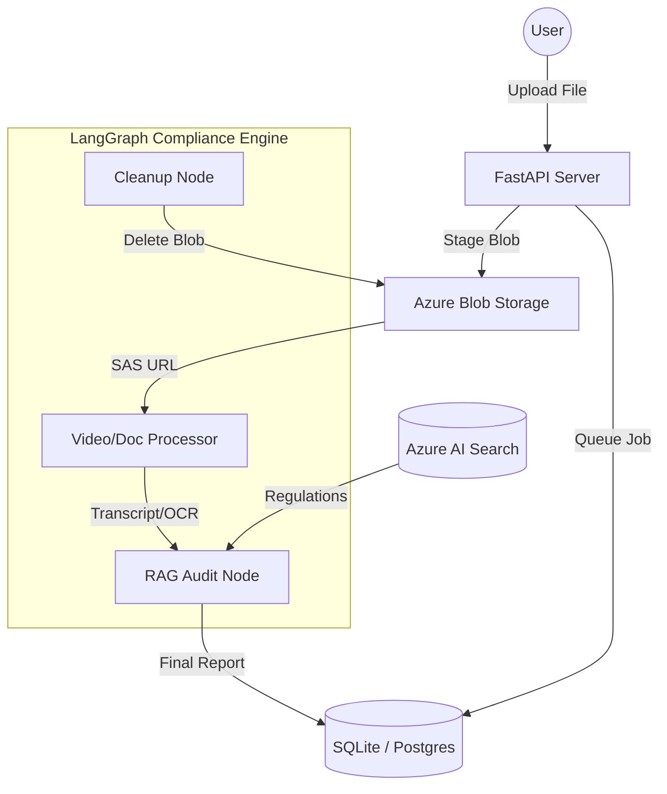

# 🛡️ PharmaGuard AI: Professional Video Compliance Auditor

PharmaGuard AI is an enterprise-grade, cloud-native compliance tool designed for the pharmaceutical industry. It automates the **Medical-Legal-Regulatory (MLR)** review process for video advertisements and documents, ensuring compliance with FDA 21 CFR Part 202 and ICH guidelines.

---

## 🚀 Key Features

*   **Cloud-Native Ingestion**: Direct-to-Cloud staging via Azure Blob Storage. No local file storage required.
*   **State-of-the-Art Analysis**: Uses **Azure Video Indexer** (for transcription/OCR) and **Azure AI Search** (RAG-augmented regulatory retrieval).
*   **Intelligent Auditing**: A complex **LangGraph** workflow that evaluates:
    *   **Fair Balance**: Prominence of risks vs. benefits.
    *   **Unsubstantiated Claims**: Flagging "miracle," "cure," or "100% effective" without clinical proof.
    *   **Required Disclosures**: Generic names and Prescribing Information (PI) references.
    *   **Visual-Audio Consistency**: Matching voice-over warnings with on-screen text.
*   **Clean Architecture**: Fully externalized prompts and modular service-oriented design.
*   **Cost-Optimized Persistence**: Persistent job tracking using a volume-mounted SQLite store (Cloud-Ready for $0.10/month).

---

## 🏗️ Architecture Diagram



---

## 🛠️ Tech Stack

*   **Backend**: Python 3.11, FastAPI
*   **AI Orchestration**: LangGraph, LangChain
*   **Cloud**: Azure (OpenAI, Video Indexer, AI Search, Blob Storage)
*   **Database**: SQLite (Local) / Azure Cosmos DB (Ready)
*   **DevOps**: Docker, GitHub Actions

---

## 🏁 Quick Start

### 1. Clone & Install
```bash
git clone <your-repo>
pip install -r requirements.txt
```

### 2. Configure Environment
Create a `.env` file with the following:
*   `AZURE_OPENAI_KEY`, `AZURE_OPENAI_ENDPOINT`
*   `AZURE_SEARCH_ENDPOINT`, `AZURE_SEARCH_API_KEY`
*   `AZURE_STORAGE_CONNECTION_STRING`
*   `AZURE_VI_ACCOUNT_ID`, `AZURE_VI_API_KEY`

### 3. Run Locally
```bash
uvicorn backend.src.api.server:app --reload
```
Visit `http://localhost:8000/docs` to test the API.

---

## 🚢 Production Deployment

### Docker
```bash
docker build -t pharma-audit-api .
docker run -p 8000:8000 pharma-audit-api
```

### Azure Deployment (Cost Optimized)
To host this for near-zero cost:
1.  Deploy the Docker image to **Azure Container Apps**.
2.  Mount an **Azure File Share** to `/app/jobs.db` to ensure your database is persistent.
3.  The system will automatically use **Azure Storage** for temporary files and clean them up after every audit.

---

## 📜 Regulatory Scope
Evaluates compliance against:
*   FDA 21 CFR Part 202
*   ICH E6 (R2) Guidelines
*   MLR Internal Best Practices
